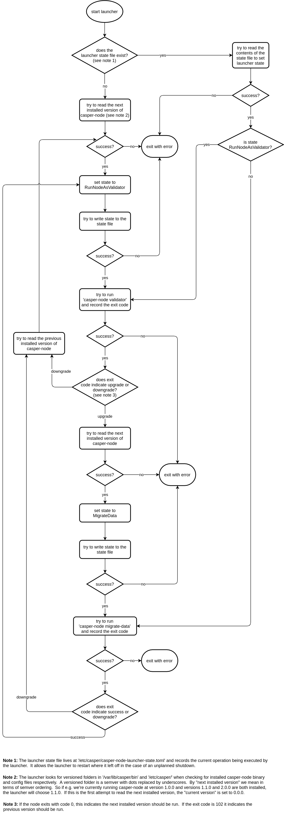

# Node Upgrades

## Summary

[summary]: #summary

CEP PR: [casperlabs/ceps#0037](https://github.com/casperlabs/ceps/pull/0037)

This CEP describes the how the `casper-node-launcher` and `casper-node` will interact to achieve network upgrades.

## Guide-level explanation

[guide-level-explanation]: #guide-level-explanation

The `casper-node-launcher` is a relatively simple Rust binary which runs the `casper-node` binary as a child process.
Normal operation will see the launcher running indefinitely, cycling upwards through versions of the node as and when
they become active.

The node has two relevant modes of operation: "validator mode", and "migrate-data mode".  The normal mode is validator.
The migrate-data mode is used immediately after an upgrade to migrate any data stored on disk as required.

The node also has three possible exit codes: 0, 101 or 102.  0 indicates success, 101 indicates an error (e.g. a panic)
and 102 indicates the node should be downgraded to a previous version.  These exit codes are read and reacted to by the
launcher.

On startup, the launcher either tries to read its previously cached state from disk, or assumes a fresh start.  On a
fresh start, the launcher searches for the lowest installed version of `casper-node` and starts running it in validator
mode.

If the launcher cannot find an appropriate version at any stage of upgrading or downgrading, it exits with an error.

## Reference-level explanation

[reference-level-explanation]: #reference-level-explanation

### casper-node-launcher

The following describes the control flow in the launcher:

### casper-node

On startup, the node needs to decide what action to take depending upon whether it is an initial run (without fast sync
this will always be treated as running from genesis), a restart after an upgrade, or a restart after an unexpected
shutdown.  The previous run (if any) is deduced by examining the stored linear chain, specifically by querying the
highest block, and comparing that to the current and next (if available) activation points.

Note that if a node starts with a chainspec which specifies `protocol.hard_reset = true`, then all blocks created in or
after the chainspec's activation point are effectively removed from storage, creating a situation as if the node had
ceased operating at the end of the appropriate era.  This option is seen as a failsafe, to cater for the scenario where
the network has ceased operating properly mid-era.

The actions a node will take on startup, in the order in which they are tested, are summarized below:

* HB = highest block
* PV = protocol version
* AP = activation point
* current X = value taken from current chainspec
* next X = value taken from next upgraded chainspec

| Condition                                           | Scenario                                     | Action                                   |
| :-------------------------------------------------- | :------------------------------------------- | :--------------------------------------- |
| no blocks in storage, and PV 1.0.0                  | initial run                                  | commit genesis and continue running      |
| no blocks in storage, and PV not 1.0.0              | invalid initial run                          | exit with code 102 to downgrade          |
| HB.era + 1 == current AP and HP is switch block     | restart immediately after upgrade            | commit upgrade and continue running      |
| HB.era + 1 == current AP and HP is not switch block | invalid run - blocks missing from storage    | exit with code 102 to downgrade          |
| HB.era < current AP                                 | invalid run - blocks missing from storage    | exit with code 102 to downgrade          |
| HB.PV != current PV                                 | restart after fork                           | treat as hard-reset and continue running |
| HB.PV == current PV and no next chainspec available | unplanned shutdown with no scheduled upgrade | continue running                         |
| HB.era < next AP                                    | unplanned shutdown before scheduled upgrade  | continue running                         |
| HB.PV != next PV                                    | missed an upgrade and forked                 | treat as hard-reset and continue running |
| HB.PV == next PV                                    | running old version                          | exit with code 0 to upgrade              |

The node checks for a newer node version having been installed on every new block created.  If it finds an upgrade, it
reads the chainspec associated with the new version to establish the activation point.  It then schedules itself to exit
at the end of the era immediately before that activation point.

## Drawbacks

[drawbacks]: #drawbacks

1. We don't have the ability to slash across major protocol version upgrades.  This is not a major problem; only
unsuccessful attempts to disrupt the network will go unpunished.  Successful attempts will be subject to manual slashing
via social consensus.

## Unresolved questions

[unresolved-questions]: #unresolved-questions

None
